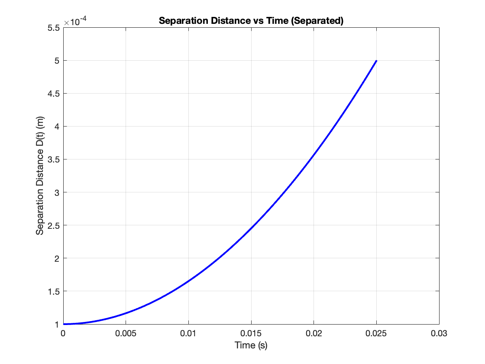

# MATLAB Monte Carlo Simulation: Predicting Particle Escape Times from Thin Oil Films

## Background

In food engineering, tracking how flavor molecules escape thin oil layers is crucial for optimizing taste delivery. This project models a flavor particle escaping an oil film boundary layer. 

Because real-world variables like particle size and oil viscosity change naturally, a single test isn't enough. This project wraps a **Forward Euler ODE solver** inside a **Monte Carlo simulation** to analyze how the starting distance affects overall escape times across 14,000 unique random trials.

* **The Physics:** A particle is pulled by a constant force ($F_0$) while fighting an inverse-distance fluid drag force ($\propto 1/D$) near a solid wall.



* **The Method:** 1,000 random trials per distance tier using a **Uniform Distribution** for particle size and a **Normal Distribution** for fluid viscosity.

---

## Files

| File | Description |
| :--- | :--- |
| **`monte_carlo_final.m`** | Main script. Handles the random loops, runs the Euler physics engine, and outputs the final statistical 

---

## How to Run

Place `monte_carlo_final.m` in your MATLAB directory and run it from the **Command Window**:

```matlab
>> monte_carlo_final
